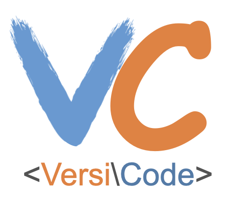

<div align="center">



**VersiCode: Towards Version-controllable Code Generation.**


[](https://opensource.org/licenses/MIT)


---

<p align="center">
    <a href="###QuickStart">QuickStart</a> •
    <a href="https://arxiv.org/abs/2406.07411">Paper</a> •
    <a href="https://huggingface.co/datasets/AstoneNg/VersiCode">Benchmark</a> •
    <a href="https://wutong8023.github.io/VersiCode.github.io/">Website</a> •
</p>
</div>

This repository contains the data and inference code of 
paper "[VersiCode: Towards Version-controllable Code Generation](https://arxiv.org/abs/2406.07411)."

## Requirements

- Clone the Repository via `git clone https://github.com/wutong8023/VersiCode.git`
    - **Please email us if you need the raw data.**
- Install dependencies via `pip install -r requirements_gpt.txt` to run the gpt scripts and evaluating scripts.
- Install dependencies via `pip install -r requirements_vllm.txt` to run the vllm scripts
- Install dependencies via `pip install -r requirements_togetherai.txt` to run the togetherai scripts


## Evaluation on VersiCode
Unzip the VersiCode_Benchmark.zip file to get the data, and put it in the data folder.

Our evaluation consists of two steps: generation and metrics calculation.


### QuickStart

#### HuggingFace Models
For open-sourced models like StarCoder, DeepSeek-Coder, etc., we download them from [huggingface](https://huggingface.co/) and use [vLLM](https://github.com/vllm-project/vllm) for inference, take token experiment as example. 

```bash
python test_token.py
```

#### OpenAI models
OpenAI models are accessible through an API. Taking token experiment as an example, change apikey and dataset path:
```bash
python test_token_generate_chunk.py
```

#### togetherai models
The device is not sufficient to run a model that is too large, so [togetherai](https://api.together.xyz/models) can be used. togetherai models are accessible through an API. Taking token experiment as an example, change apikey and dataset path:
```bash
python test_token_generate_chunk.py
```

### Metrics Calculation
After obtaining the generation, you need to clear the model_output to clear <start> and <end>, then we can calculate the final metrics. Taking the token experiment as example.
```bash
python test_token.py
```

## Citation

```
@article{versicode,
  author={Tongtong Wu and Weigang Wu and Xingyu Wang and Kang Xu and Suyu Ma and Bo Jiang and Ping Yang and Zhenchang Xing and Yuan-Fang Li and Gholamreza Haffari},
  title        = {VersiCode: Towards Version-controllable Code Generation},
  journal      = {CoRR},
  volume       = {abs/2406.07411},
  year         = {2024},
  url          = {https://arxiv.org/abs/2406.07411},
}
```
## Questions
Please feel free to submit an issue in this repo.
